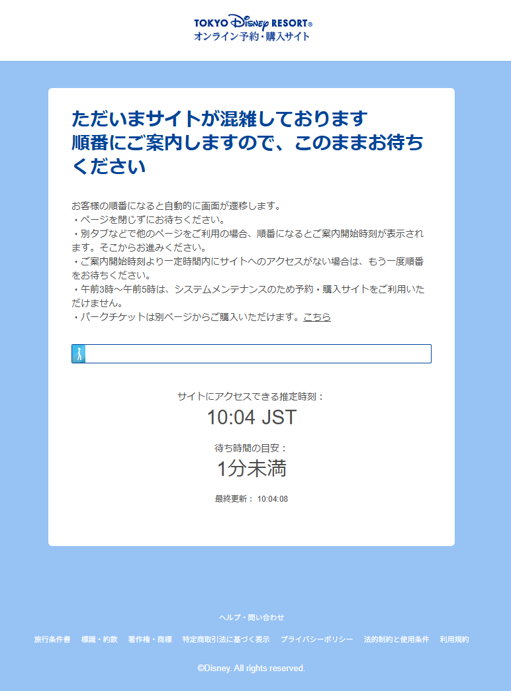
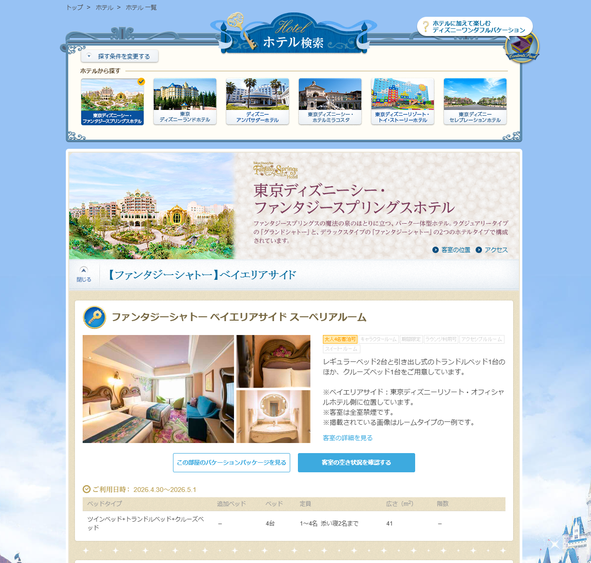
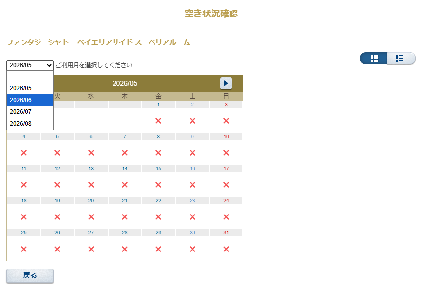

# Plan: オフィシャルホテル予約チェッカー

## 概要

Azure Container Apps + Selenium (headless Chrome) でホテル予約サイトをクローリングし、
空きあり（×以外の日付が1つでも存在する）カレンダーのスクリーンショットを Azure Blob Storage に保存して
`{"result": true/false}` を返す。
アプリは Flask で構成し、Docker コンテナとして Container Apps 上で稼働する。

---

## 対象サイトについて

- 対象URL
    - https://reserve.tokyodisneyresort.jp/hotel/list/?showWay=&roomsNum=&adultNum=3&childNum=&stayingDays=1&useDate=&cpListStr=&childAgeBedInform=&searchHotelCD=FSH&searchHotelDiv=&hotelName=&searchHotelName=&searchLayer=&searchRoomName=&hotelSearchDetail=true&detailOpenFlg=0&checkPointStr=&hotelChangeFlg=false&removeSessionFlg=true&returnFlg=false&hotelShowFlg=&displayType=hotel-search&reservationStatus=1
- ページ遷移仕様
  - 空き状況確認サイト入場前に、入場待機ページが表示される場合がある(添付画像)。その場合はページが遷移するのを待ってから作業を開始する必要がある
    - 
  - 検索ページ内の「客室の空き状況を確認する」ボタンを押下するとカレンダーが表示される
    - 
    - **このボタンはページ内に複数存在しており、すべてのボタンを押下してカレンダーの確認をする必要がある**
  - カレンダーの日付選択ドロップダウンリストでカレンダーの表示を切り替える。 **今回のチェック対象は選択できる月すべてである**
    - 

---

## システム仕様

| 項目 | 内容 |
|------|------|
| システム名 | オフィシャルホテル予約チェッカー |
| ホスティング | Azure Container Apps |
| Web フレームワーク | Flask |
| エンドポイント | `GET /check` (引数なし) |
| レスポンス | `{"result": true}` (storageに保存した画像キャプチャあり) / `{"result": false}` (対象なし) |
| Python | 3.13 |
| ベースイメージ | `python:3.13-slim` + Chromium |
| Blob コンテナ名 | `hotelreserve` |


### ×検知方法
DOM要素のクラス名またはテキスト `'×'` で判定 (セレクタは定数として外出し)

#### X以外の情報が含まれている場合のDOM(料金が表示されます)
```html
<dd class="calendarImage few">
    <span>1</span>
    <em class="minimumAmount">300,000円</em>
</dd>
```

#### XのDOM
```html
<dd class="calendarImage vMiddle">
    <span>
        
    </span>
</dd>
```

---

## ディレクトリ構成

```
DOfficialHTLChecker/hotel-reserve-checker/
├── app.py                   # Flask メインアプリ
├── Dockerfile               # コンテナイメージ定義
├── docker-compose.yml       # ローカル開発用
├── .env.example             # 環境変数サンプル
├── requirements.txt
└── modules/
    ├── __init__.py
    ├── blob_client.py       # Blob操作
    └── browser.py           # Selenium制御・待機・キャプチャ・×検知
```

---

## Phase 1: プロジェクト雛形

1. `DOfficialHTLChecker/hotel-reserve-checker/` ディレクトリ作成
2. `Dockerfile` — `python:3.13-slim` ベース、Chromium + chromedriver のインストール、Flask 起動
3. `docker-compose.yml` — ローカル開発用。環境変数を `.env` から読み込み、ポート `5000` をマップ
4. `.env.example` — `AZURE_STORAGE_CONNECTION_STRING`, `HOTEL_URL` のサンプル定義
5. `requirements.txt` — `flask`, `selenium`, `azure-storage-blob`
6. `modules/` ディレクトリ

---

## Phase 2: Blob クライアント (`modules/blob_client.py`)

*Phase 1 に依存*

1. `BlobServiceClient` を接続文字列で初期化 (v12 SDK)
2. **`clear_container(container_name)`** — `list_blobs` で全Blob列挙 → 各Blobを `delete_blob` で削除
3. **`upload_image(container_name, blob_name, image_bytes)`** — `upload_blob` でPNGバイト列をアップロード。Blob名は `{YYYYMMDD_HHMMSS}_{index}.png` 形式

---

## Phase 3: ブラウザモジュール (`modules/browser.py`)

*Phase 1 に依存 (Phase 2 と並行実装可)*

1. **`init_driver()`** — `webdriver.Chrome` を headless オプションで初期化。`webdriver-manager` で chromedriver を自動取得
2. **`wait_for_queue_page(driver, timeout_sec=600)`** — 入場待機ページの検知ループ:
   - 検知条件: ページ内に `"待ち時間の目安"` テキスト or 待機固有の要素 (セレクタ定数: `QUEUE_PAGE_SELECTOR`)
   - 10秒 interval でポーリング → テキストが消えたら抜ける
   - timeout 超過時は例外 raise
3. **`has_availability(driver, calendar_element)`** — カレンダー要素内の日付要素を全取得し、`×` **以外**が1つでも存在すれば `True` を返す
   1. `x` の判定については上記 「×検知方法」の項目を参照すること
4. **`capture_element(driver, element)`** — 要素のスクリーンショット (`element.screenshot_as_png`) を返す
5. webサイト内導線については上記「対象サイトについて」を参照すること

---

## Phase 4: メイン Flask アプリ (`app.py`)

*Phase 2, 3 に依存*

```python
@app.route("/check", methods=["GET"])
def hotel_reserve_checker():
    ...
```

処理フロー:
1. 起動時に環境変数 `HOTEL_URL`, `AZURE_STORAGE_CONNECTION_STRING` を読み込み (`python-dotenv` または OS 環境変数)
2. `GET /check` リクエスト受信
3. `clear_container("hotelreserve")` — 既存画像を全削除
4. ブラウザ起動 → `HOTEL_URL` へアクセス → `wait_for_queue_page()` で待機解除
5. ナビゲーション実行
6. カレンダー要素リストを取得 → 各カレンダーに `has_availability()` を適用
7. 条件を満たしたカレンダーごとに `capture_element()` → `upload_image()` でBlob保存
8. `captured_count > 0` なら `{"result": true}`、`0` なら `{"result": false}` を JSON で返す
9. `finally` でブラウザを `driver.quit()`
10. Blob/Selenium 例外は `logging.error` に記録して HTTP 500 を返す

---

## 参考にする既存コード

| ファイル | 参考にする内容 |
|----------|----------------|
| `scraping/reserve-tdr/checkBlank.py` | Selenium初期化・要素取得パターン |
| `azure/azureBlob/download.py` | Blob列挙パターン (v12 SDKへ更新) |
| `fastapi/main.py` | Flask アプリ構成の参考 (fastapi→flask に読み替え) |

---

## 検証手順

1. `.env.example` をコピーして `.env` を作成し、実際の接続文字列・URLを記入
2. `docker compose up --build` でローカルコンテナを起動
3. `curl -X GET http://localhost:5000/check` でエンドポイントを叩き、`{"result": true/false}` が返ることを確認
4. Azure Portal で `hotelreserve` コンテナ内に `.png` ファイルが格納されていることを確認
5. 待機ページが表示される時間帯に実行してポーリング待機→遷移が正しく動作するか確認
6. Container Apps へのデプロイ: `az containerapp up` でイメージをビルド・プッシュ・デプロイ

---

## 対象外スコープ (今回)

- ボタン導線ナビゲーション (後で追加指示)
- Container Apps リソース作成・デプロイ設定 (`az containerapp up` コマンド群)
- Container Apps の認証・イングレス設定 (本番前に要検討)
- Container Registry (ACR) の構築
